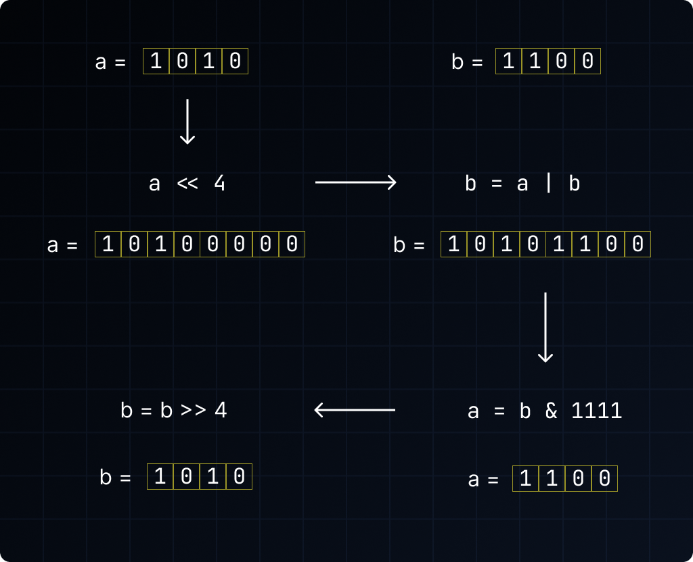

# Swapping variables?

This repository walks though on my implementation of swapping two variables without using a temporary variable or arithmetic operations or XOR.

# Algorithm

1. Initialize two variables, `a` and `b`, with the values to be swapped.
2. Shift `a` to the left by the number of bits in `b`.
3. Perform a **bitwise OR** between `a` and `b`, storing the result in `b`.
4. Perform a **bitwise AND** between `b` and a sequence of `1`s matching the number of bits in `b`, storing the result in `a`.
5. Shift `b` to the right by the number of bits in `b`.
6. **Done!**



# Code

```c
#include <math.h>
#include <stdio.h>

int main() {
  int a, b;
  printf("a and b: ");
  scanf("%d %d", &a, &b);

  int bitsOfB = log2(b) + 1;

  a = a << bitsOfB;
  b = a | b;

  int ones = pow(2, bitsOfB) - 1;

  a = b & ones;
  b = b >> bitsOfB;

  printf("a = %d, b = %d\n", a, b);

  return 0;
}
```

# Complexity

- Time complexity: `O(1)`
- Space complexity: `O(1)`

# Author

- [Krish][github]

[github]: https://github.com/ikrishagarwal
